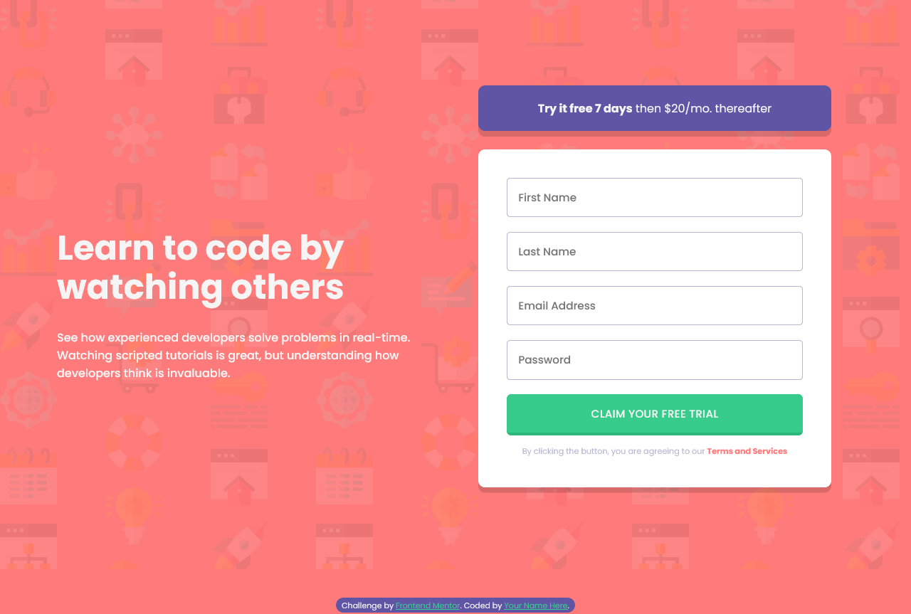
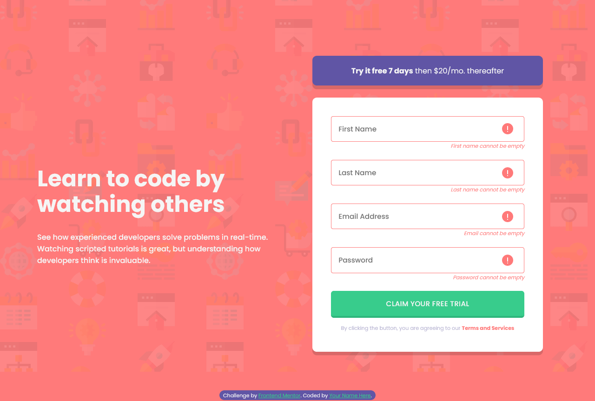

# Frontend Mentor - Intro component with sign up form solution

This is a solution to the [Intro component with sign up form challenge on Frontend Mentor](https://www.frontendmentor.io/challenges/intro-component-with-signup-form-5cf91bd49edda32581d28fd1). Frontend Mentor challenges help you improve your coding skills by building realistic projects. 

## Table of contents

- [Overview](#overview)
  - [Screenshot](#screenshot)
  - [Links](#links)
- [My process](#my-process)
  - [Built with](#built-with)
  - [What I learned](#what-i-learned)
  - [Useful resources](#useful-resources)
- [Author](#author)


## Overview


### Screenshot





### Links

- Solution URL: [Add solution URL here](https://your-solution-url.com)
- Live Site URL: [Add live site URL here](https://your-live-site-url.com)

## My process

### Built with

- Semantic HTML5 markup
- CSS custom properties
- Flexbox
- CSS Grid
- Mobile-first workflow

### What I learned

input validation using javascript

```js
let input = document.getElementById("form").children


function Validation ()  {
    for (i=0; i <= 3; i++) {
        let input_container = input[i]
        let input_field = input_container.children[0]
        let emphasized_text = input_container.children[1]
        if (input_field.value === '') {
            input_field.style.background = "url('/images/icon-error.svg') no-repeat right"
            input_field.style.backgroundPositionX = '94%'
            input_field.style.borderColor = 'var(--red)'
            emphasized_text.classList.remove('hidden')
            if (i === 2) {
                emphasized_text.innerText = "Email cannot be empty"
            }
        } else if (i === 2) {
            if (!input_field.value.match(/^[A-Za-z\._\-0-9]*[@][A-Za-z]*[\.][a-z]{2,4}$/)) {
                emphasized_text.classList.remove('hidden')
                emphasized_text.innerText = "Looks like this not an email"
                input_field.style.background = "url('/images/icon-error.svg') no-repeat right"
                input_field.style.backgroundPositionX = '94%'
                input_field.style.borderColor = 'var(--red)'
            } else {
                input_field.style.background = "none"
                input_field.style.borderColor = "var(--grayish-blue)"
                emphasized_text.classList.add('hidden')
            }
        } else {
            input_field.style.background = "none"
            input_field.style.borderColor = "var(--grayish-blue)"
            emphasized_text.classList.add('hidden')
        }
        
        
    }
}
```


### Useful resources

- [iterating through child element](https://stackoverflow.com/a/17094318) - This helped me on how to iterate through a list of child elements of a parent element

## Author

- Frontend Mentor - [@Mr-jaw](https://www.frontendmentor.io/profile/Mr-jaw)


